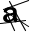
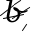
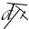
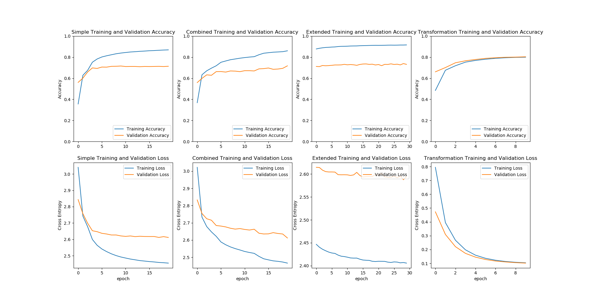

# Scratched-OCR
A neural network attempts to classify characters on computer generated images using different fonts and scratches

# Examples of pictures the networks attempts to classify

 
 
 
 

# The Objectives

The objectives are the following

- Build a basic neural network able to be trained on a little dataset (a few thousand images)

- Build a network able to "clean" scratched images

- Build a network using the cleaner network to classify the images

- Test if the method is better than the direct classification task

# What has been done

I use around 400 fonts and every letter of each font. (All of the fonts on my computer excluding some exotic fonts and the fonts which don't support lower case characters.)

I use processing to generate black and white scratched and clean image pairs. I use a 80/10/10 split for training/validation/test. (One font can only belong to one data set.)

I build and train a small neural network (named "Simple") to classify damaged images : it consists of one convolution layer and a dense layer.

I build and train a small neural network (named "Transformation") to clean damaged images using the clean images as labels : it consists of two convolution layers.

I build and train a neural network (named "Combined") to classify damaged images by combining the cleaning NN and a randomly initialized NN with the same architecture as the first NN.

I compare its results with a neural network (named "Advanced") with the same architecture, but with weights initialized randomly (all 3 convolution layers and the dense layer).

# Results

Here are the learning curves of all 4 networks.

 

Performances of all three classification networks are good given the difficulty of the task but still far below the human level performance (accuracy = 70%).

Contrary to what one could expect, the cleaner network doesn't seem to help at all.

Overfitting is a real issue here. One possible improvement could be to try a new kind of scratch on each image.

# How to Use It

Run CharacterRecongnitionDataCreator.pde using Processing to generate the datasets. You might need to change which are the "wrong" fonts if your fonts are different from mine.

Run main.py to train the networks (results will be saved to hits.pkl). You might need to change the step_per_epoch parameter (in the training method of network.py) to cover the entire dataset on each epoch.

Run plotter.py to see how the training went.
